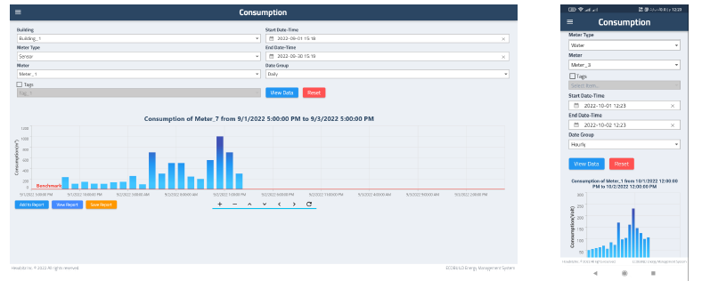
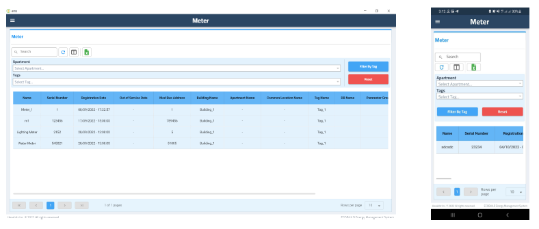

# donut_shop_UI
A fully animated donut shop ui flutter app.
## preview
https://github.com/user-attachments/assets/0072b64d-2f8b-4ec5-bcdd-1849ca88751b
## features
- multiple complex animations.
- utlizes flutter hooks package to use animation controlers and streams without the need of statfull widget.

# ddd_pokedex
- a fully functional pokedex mobile aplication using Flutter, Firebase and, Pokeapi (api for all pokemon related data)
- design inspired from https://www.figma.com/design/F3XebLb5OllI10IZ4O6Qcf/Pok%C3%A9dex-%2F-Pok%C3%A9mon-App-(Community)?node-id=1268-35268&m=dev
## preview
https://github.com/user-attachments/assets/7c517650-c578-4b4e-a738-0143569162ae
## features
- dashboard screen
- onboarding screen
- autentication using (email,password/google signin)
- state management using bloc
- dependenci injection using injectable package (get_it generator)
- local storage using hive package
- routing using auto_router package
- pokemon list view that shows all the downloaded pokemons with filtering on pokemon type(fire, water, grass,... etc), ordering filter, pokemon search by name/number and, add pokemon to favorites feature  
- pokemon details screen containg all the important info about the pokemon like stats, gender ration, damage relations, evolution chain, ... etc.
- favorite pokemon list page
- settings/profile page

# EMS (Energey management system)
-A multi-platform IoT Power Management and data analysis system.  
## sceenshots
 

 

 

## features
- utilize MVVM code pattern to implement clean code practices.
- implemented localization using easy_localization package for two languages (arabic - english).
- notifications.
- user roles and permitions management (By building admin).
- data analysis.
- reporting.
- exportig to pdf or excel files.
- tree view for the building.

# advanced_flutter_e-commerce_app
-A flutter e-commerce mock app that utilize MVVM code pattern.  
-all the implemented APIs are mock APIs created usein "app.wiremock.cloud" websit.  
## sceenshots
 
 
 
## features
-this app utilize MVVM code pattern to implement clean code practices.  
-splash screen and onboarding screen.  
-the app authentication features are login, register and forget password.  
-implemented localization using easy_localization package for two languages (arabic - english).

